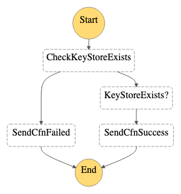

# Internals of AWS CloudHSM and Key Store Provisioning

This document provides an overview of the internals of how the `cloudhsm.yml` and `cloudhsm-key-store.yml` AWS CloudFormation templates work. This information might be useful if you either need to perform in-depth troubleshooting of a stack or would like to learn more about how the resources are provisioned.

See the [README](./README.md) for `cloudhsm.yml` template usage information and the [CLOUDHSM-KEY-STORE](./CLOUDHSM-KEY-STORE.md) for `cloudhsm-key-store.yml` template usage information.

Both templates make extensive use of AWS Step Functions state machines, AWS Lambda functions, and AWS Systems Manager documents and run commands to orchestrate CloudFormation stack create, update, and delete operations.

When you create, update, and delete a stack based on either template, you can open the AWS Step Functions console and select the corresponding state machine to monitor progress of the stack operation.

* [`cloudhsm.yml`](#cloudhsmyml)
  * [Create cluster](#create-cluster-state-machine)
  * [Update cluster](#update-cluster-state-machine)
  * [Delete cluster](#delete-cluster-state-machine)
  * Common state machines
    * [Initialize and activate cluster](#initialize-and-activate-cluster-state-machine)
    * [Align HSM count](#align-hsm-count-state-machine)
* [`cloudhsm-key-store.yml`](#cloudhsm-key-storeyml)
  * [Create key store](#create-key-store-state-machine)
  * [Update key store](#update-key-store-state-machine)
  * [Delete key store](#delete-key-store-state-machine)
  * Common state machines
    * [Connect key store](#connect-key-store-state-machine)
    * [Disconnect key store](#disconnect-key-store-state-machine)

## `cloudhsm.yml`

### Create cluster state machine

This state machine is used to process the create action associated with the custom CloudHSM cluster resource.

* Calls the CloudHSM create-cluster API to begin the process of creating a new cluster.
* Waits for the cluster creation process to complete.
* Initializes a set of secrets in AWS Secrets Manager.
* Calls the CloudHSM create-hsm API to begin the process of creating the first HSM in the cluster.
* Waits for the HSM creation process to complete.
* Adds the EC2 client's security group to the inbound rules of the cluster's security group.
* If the cluster was created from a backup, then obtain the customer CA cert used with the prior cluster from Secrets Manager. Skip to the step to initialize and activate the cluster.
* Obtain the cluster's CSR and store it in Secrets Manager.
* Determine whether an internal automated or external PKI process is to be used to process the CSR and issue a cluster certificate.
* If an external PKI process is to be used, complete the creation steps. Once the cluster cert and customer CA cert are made available in Secrets Manager, the stack can be updated to complete the cluster initialization and activations steps.
* If an internal automated PKI process is to be used, process the CSR and issue a cluster certificate.
* Execute a separate state machine to initialize and activate the cluster. See [Initialize and activate cluster state machine](#initialize-and-activate-cluster-state-machine).
* Execute a separate state machine to create zero or more additional HSMs. See [Align HSM count state machine](#align-hsm-count-state-machine).
* Optionally installs the `cloudhsm-client` package to overwrite the `cloudhsm-cli` package.

### Update cluster state machine

This state machine is used to process the update action associated with the custom CloudHSM cluster resource.

* If the EC2 client was replaced, initialize the CloudHSM client on the new EC2 instance.
* If an external PKI process was selected and the cluster cert and CA cert have been made available in Secrets Manager:
  * Execute a common state machine to initialize and activate the cluster
  * Execute a common state machine to create zero or more additional HSMs.
* If the number of HSMs per subnet parameter has changed, execute a common state machine to create or delete HSMs.
* If the CloudHSM client package to install has changed, remove the existing package and install and configure the specified package. 

### Delete cluster state machine

This state machine is used to process the delete action associated with the custom CloudHSM cluster resource.

### Initialize and activate cluster state machine

This state machine is used by both the create cluster and update cluster state machines. If `pUseExternalPkiProcess` is `true`, then initialization and activation of the cluster is deferred until the update cluster action. 

In the activate cluster step of this state machine, an AWS Systems Manager run command document is used to execute a script on the EC2 client. This script uses the CloudHSM CLI to activate the cluster.

### Align HSM count state machine

This state machine is used by both the create cluster and update cluster state machines. It's responsible for either creating or deleting HSMs depending on the value of `pHsmsPerSubnet`.

After HSMs are created or deleted, a shell script is executed on the EC2 client to update the CloudHSM CLI or client configuration to reflect the resulting set of HSMs.

## `cloudhsm-key-store.yml`

### Create key store state machine

The create key store state machine is used to process the create action associated with the CloudHSM key store custom resource.

* Determines if a same named key store already exists
* Determines if the `kmsuser` already exists in the cluster
* Creates the key store
* Executes another state machine to connect the key store to the cluster

### Update key store state machine

The update key store state machine does not currently perform any processing. In the future, it may be enhanced to support the features described in [Editing CloudHSM key store settings](https://docs.aws.amazon.com/kms/latest/developerguide/update-keystore.html).

### Delete key store state machine

The delete key store state machine is used to process the delete action associated with the custom CloudHSM key store resource.

### Connect key store state machine

The connect key store state machine is executed by the create key store state machine to connect the key store to the CloudHSM cluster.

### Disconnect key store state machine

The disconnect key store state machine is executed by the delete key store state machine to disconnect the key store from the cluster prior to optionally deleting the key store.

