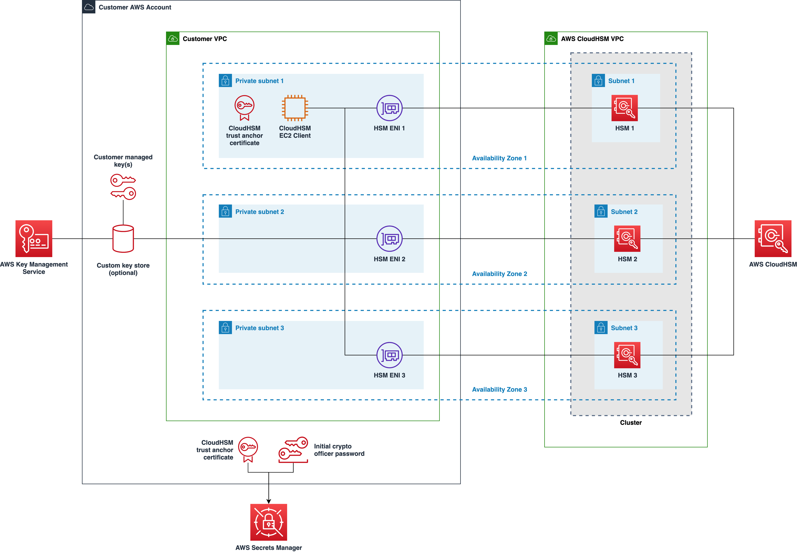
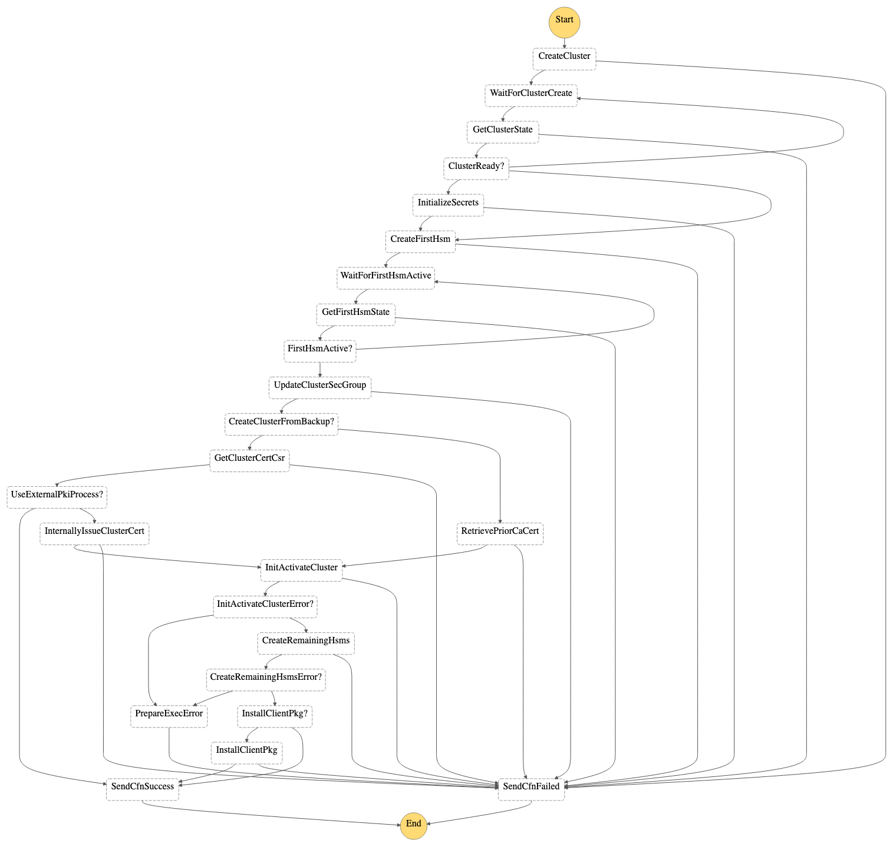
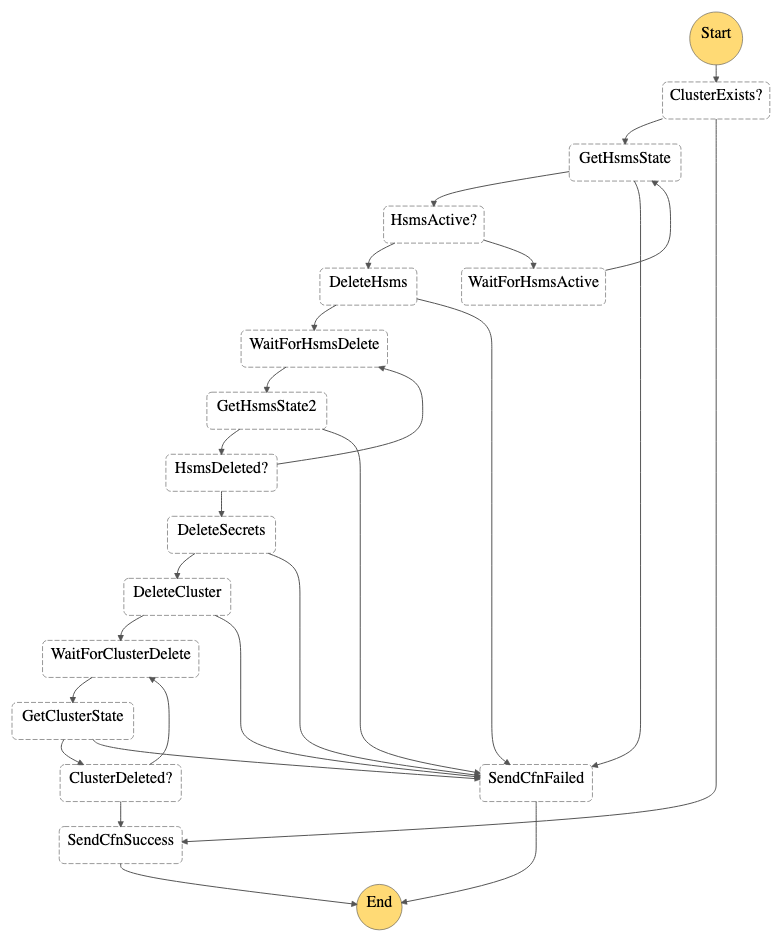

# Automated Deployment of AWS CloudHSM Resources Using AWS CloudFormation

This AWS CloudFormation template automatically deploys an [AWS CloudHSM](https://docs.aws.amazon.com/cloudhsm/latest/userguide/introduction.html) cluster with HSMs and supporting AWS resources. Optionally, the template creates an [AWS KMS custom key store](https://docs.aws.amazon.com/kms/latest/developerguide/custom-key-store-overview.html) and connects it to the CloudHSM cluster.

* [Overview](#overview)
* [Usage](#usage)
* [Managing Security](#managing-security)
* [Understanding Known Limitations](#understanding-known-limitations)
* [Creating CloudFormation Stack](#creating-cloudformation-stack)
* [Troubleshooting Stack Creation](#troubleshooting-stack-creation)
* [Performing Post Stack Creation Steps](#performing-post-stack-creation-steps)
* [Updating the Stack](#updating-the-stack)
* [Monitoring and Managing the Resources](#monitoring-and-managing-the-resources)
* [Notifying of Potential Security Issues](#notifying-of-potential-security-issues)
* [Contributing](#contributing)
* [License](#license)

## Overview

The [`cloudhsm.yaml`](cloudhsm.yaml) CloudFormation template creates a CloudHSM cluster with HSMs and optionally creates a KMS custom key store and connects it to the cluster. 

In addition to a CloudHSM cluster and HSM resources, the following resources are created in support of the cluster:

* A CloudFormation custom resource AWS Lambda function that is used to create and delete CloudHSM clusters
* AWS Step Functions state machines to orchestrate creation and deletion of CloudHSM clusters
* Lambda functions to support the state machines
* An EC2 client instance configured to manage the cluster of HSMs
* A CloudHSM CA certificate is generated and stored in Secrets Manager
* An initial crypto officer `admin` user password that is stored as a secret in AWS Secrets Manager

## Usage

### Reviewing the opinionated approach

This CloudFormation template takes an opinionated approach to deploying and initializing a CloudHSM cluster. Since this approach might not be aligned with your organization's requirements, you should review the approach before deploying and initializing CloudHSM clusters in your formal environments.

For example, this template results in an initial crypto officer password being automatically assigned. You're expected to change the crypto officer's password immediately after initialization of the cluster.

### Preparing to create a CloudHSM cluster

You should address the following considerations before using the CloudFormation template.

#### 1. Review AWS CloudHSM and KMS Custom Key Store documentation

* Ensure that you're familiar with the basic architecture and operation of [AWS CloudHSM Clusters](https://docs.aws.amazon.com/cloudhsm/latest/userguide/clusters.html)
* If you intend to use KMS custom key stores, [Using a custom key store](https://docs.aws.amazon.com/kms/latest/developerguide/custom-key-store-overview.html)

#### 2. Determine qualifier for cloud resource names

Determine a value for the [`pEnvPurpose`](#cloudformation-template-parameters) CloudFormation template parameter that will be used to help qualify the names of many of the cloud resources created by the CloudHSM stack.  If you intend to deploy only one instance of the stack and CloudHSM cluster in the AWS account, then you can use the default value.

Many of the resources created by the CloudHSM template will be qualified by a combination of the `pSystem` and `pEnvPurpose` parameter values. Normally, you won't need to override the value of the `pSystem` parameter, but if you intend to manage multiple CloudHSM clusters in the same account, then you will need to use the `pEnvPurpose` parameter to help distinguish the resources used to support the respective clusters. For example, if you create multiple stacks in the same account and in the same Region for testing purposes, then specify values such as `test1` vs `test2` for the `pEnvPurpose` parameter.

Since the CloudHSM template automatically qualifies the names of global resources such as IAM roles with the AWS Region identifier, you do not need to include a Region identifier in the `pEnvPurpose` parameter.

If you intend to create multiple CloudHSM clusters in a single AWS account, then review [AWS CloudHSM Quotas](https://docs.aws.amazon.com/cloudhsm/latest/userguide/limits.html) so that you're aware of the default upper limit of the number of clusters and HSMs you can create in each account.

#### 3. Determine the number of HSMs to create

If you intend to create a KMS custom key store, you'll need to specify at least two HSMs via the [`pNumHsms`](#cloudformation-template-parameters) CloudFormation template parameter.

Typically, you will want to create at least two HSMs for each CloudHSM cluster. However, in support of some testing scenarios, you might want to reduce the time required to create the stack by specifying a single HSM.

#### 4. Ensure a suitable VPC and subnets are available

Determine an existing VPC with which you want the HSMs and KMS custom key store associated.  If you're provisioning a KMS custom key store, then your existing VPC must have at least two (2) private subnets that are in different Availability Zones (AZs).

You can optionally use the  [`vpc.yaml`](vpc.yaml) CloudFormation template to automatically create a VPC that is suitable for use with CloudHSM.

Currently, the [`cloudhsm.yaml`](cloudhsm.yaml) CloudFormation template automatically identifies the compatible AZs in the AWS Region and will automatically associate each HSM with a distinct AZ and subnet.

#### 5. Determine the subnet in which to deploy the EC2 client instance

You'll need to determine the VPC and subnet in which an EC2 client instance that interacts with the HSMs in the cluster. Typically, the subnet will be in the same VPC as the HSMs ENIs.

#### 6. Determine whether or not you want to create a KMS custom key store

By default, the template creates a CloudHSM cluster with the specified number of HSMs and an EC2 client to help you manage the cluster.

If you plan on using KMS with your CloudHSM cluster, you can override the [`pStackScope`](#cloudformation-template-parameters) CloudFormation template parameter to specify that a KMS custom key store should be created. As a result, the custom key store will be connected to the CloudHSM cluster.

## Managing Security

A security review has been performed on the CloudFormation templates contained in this repository. This solution assumes that CloudHSM cluster will be deployed and managed in the following manner:
- You specify a private subnet that does not support publicly addressable IP addresses to be used for the EC2 client instance
- You stop (not terminate) the EC2 client instance once management has been completed so that it is normally in the `stopped` state
- You power on the EC2 client instance to the `running` state when you need to manage the CloudHSM cluster via the EC2 client instance
- You access the EC2 client instance only through AWS Systems Manager (SSM) Session Manager
- You take measures to either patch the EC2 client in place using AWS Systems Manager or similar or you periodically replace the EC2 client instance by updating the stack. See [Managing the EC2 client instance](#managing-the-ec2-client-instance) for details.
- You limit interactions with the CloudHSM cluster and its HSMs during normal operations to the use of the KMS service and use of the custom key store
- You take the following steps immediately after the CloudHSM cluster is created:
  1. The Crypto Officer/Primary Crypto Officer (CO/PCO) password is changed
  1. Once the password is changed, it should be stored in a secure password vault

See [Performing Post Stack Creation Steps](#performing-post-stack-creation-steps) for details on managing the Crypto Officer/Primary Crypto Officer (CO/PCO) password.

### Static analysis of the CloudFormation templates

The CloudFormation templates `cloudhsm.yaml` and `vpc.yaml` has been scanned by Stelligent's [cfn_nag](https://github.com/stelligent/cfn_nag) static analysis tool to evaluate vulnerabilities. All `failing` violations has been resolved but `warning` findings have been left intact to inform users of potential security findings that should be reviewed before using the templates. For a complete report of these warnings and notes on why they were not resolved, see the `security/` folder.

## Understanding Known Limitations

CloudHSM stack update operations do not generally support modification of stack parameters except for the AMI ID if an AMI ID was originally used to create the stack.

Updating other parameters, for example, the number of HSMs, is not yet supported via CloudHSM stack updates.

## Creating CloudFormation Stack

Once you've addressed the preparation steps, you're ready to create the stack.

### 1. Create the stack

Use the [`cloudhsm.yaml`](cloudhsm.yaml) CloudFormation template to create a new stack.

#### CloudFormation Template Parameters

|Parameter|Required|Description|Default|Supported in Stack Updates?|
|---------|--------|-----------|-------|---------------------------|
|`pSystem`|Optional|Used as a prefix in the names of many of the newly created cloud resources. You normally do not need to override the default value.|`cloudhsm`|No|
|`pEnvPurpose`|Optional|Identifies the purpose for this particular instance of the stack. Used as part of the prefix in the names of many of the newly created resources. Enables you to create and more easily distinguish resources of multiple stacks in the same AWS account. For example, `1`, `2`, `test1`, `test2`, etc.|`1`|No|
|`pStackScope`|Optional|Scope of the stack to create: `with-custom-key-store`: CloudHSM cluster + EC2 client instance + KMS custom key store `cluster-and-client-only`: CloudHSM cluster + EC2 client instance|`cluster-and-client-only`|No|
|`pVpcId`|Optional|The VPC in which the HSM Elastic Network Interfaces (ENIs) will be provisioned and in which the EC2 client instance will be deployed.|None|No|
|`pNumHsms`|Optional|Number of HSMs to create in the CloudHSM cluster: `1`, `2`, or `3`. When using a KMS custom key store, a minimum of 2 HSMs is required.|`2`|No|
|`pBackupRetentionDays`|Optional|Number of days to retain CloudHSM cluster backups. You may specify from `7` to `379` days.|`90`|No|
|`pBackupId`|Optional|ID of CloudHSM backup if you want create the cluster from a backup|None|No|
|`pClientInstanceSubnet`|Required|The subnet in which the EC2 client will be deployed|None|No|
|`pClientInstanceType`|Optional|Instance type to use for the EC2 client|`t3a.small`|Yes|
|`pClientInstanceAmiSsmParameter`|Optional|SSM parameter name for EC2 AMI to use for the EC2 client.|`/aws/service/ami-amazon-linux-latest/amzn2-ami-hvm-x86_64-ebs`|No|
|`pClientInstanceAmiId`|Optional|ID of EC2 AMI to use for the EC2 client.  Overrides `pClientInstanceAmiSsmParameter` when present.  If you desire to have direct control over the AMI in use, specify this parameter.|None|Yes|

### 2. Monitor progress of stack creation

Typically, creation of the stack will take from ~10 to ~50 minutes depending on the number of HSMs to be created and whether or not a KMS custom key store is created and connected to the cluster.

The general order in which cloud resources are created is as follows:
* IAM service roles for AWS StepFunctions and Lambda
* Lambda functions to support StepFunction state machines
* StepFunction state machines
* CloudFormation Custom resource Lambda function
* CloudHSM cluster and the first HSM
  * The CloudFormation custom resource is called with the `create` action
  * This action triggers execution of the CloudHSM cluster create state machine in Step Functions
  * That state machine creates the CloudHSM cluster and the first HSM before signaling to CloudFormation that the `create` action is complete
* CloudHSM cluster Crypto Officer (CO) `admin` user password is generated and stored in Secrets Manager
* IAM service role and EC2 instance profile for the EC2 client instance
* EC2 client instance
  * An EC2 UserData script is used in conjunction with [`AWS::CloudFormation::Init`](https://docs.aws.amazon.com/AWSCloudFormation/latest/UserGuide/aws-resource-init.html) to bootstrap the CloudHSM client instance
    * CloudWatch agent is configured
    * Package dependencies are installed
    * CloudHSM cluster certificate is generated and stored in AWS Secrets Manager
    * CloudHSM cluster is initialized
    * CloudHSM client service is started
    * An initial value for the CloudHSM cluster crypto officer password is set and stored in Secrets Manager
    * CloudHSM cluster is activated
    * Additional HSMs are added as necessary per the value of the parameter `pNumHsms`
    * Optionally, a `kmsuser` is added to the cluster and KMS custom key store is created and connected to the cluster

#### Monitoring Step Functions state machines

During creation of the stack, you can open the AWS Step Functions console and select the cluster creation state machine to monitor progress of the creation of the cluster and the first HSM.

Since the processes required to create and delete clusters and HSMs may take longer than the maximum Lambda function execution time of 15 minutes, a pair of AWS Step Functions state machines are used to orchestrate these long running workflows.

**CloudHSM cluster create state machine**

**CloudHSM cluster delete state machine**

#### Monitoring EC2 client instance configuration

After the CloudHSM cluster and initial HSM are created via the Step Function state machine, the other long duration task is the configuration of the EC2 client instance.

Upon either successful execution of the first boot automation or an error, a notification will be sent to CloudFormation indicating the result of configuring the EC2 client instance. This notification will enable CloudFormation to complete configuration of the EC2 client instance resource.

You have several options for monitoring the progress of EC2 client instance configuration:

**CloudWatch Logs**

Access the CloudWatch console and select the log group of interest. The name of the log group is based on the value of the `pSystem` and `pEnvPurpose` CloudFormation template parameters. For example, `/cloudhsm/1`

In the proper log group, select the `cfn-init.log` log stream to monitor the progress of the first boot automation.  Review the content of the [`AWS::CloudFormation::Init`](cloudhsm.yaml) section in the CloudFormation template for the sequence of scripts that are executed.

**AWS Systems Manager Session Manager**

You can also connect directly to the EC2 client instance via AWS Systems Manager Session Manager to access a terminal session.

1. Access the EC2 service of the AWS Management Console
1. Choose the EC2 client instance
1. Choose "Connect" in the upper portion of the console
1. Choose the "Session Manager" option
1. Choose "Connect"

Once you're in the terminal session:

1. `$ cd /var/logs`
2. `$ tail -f cfn-init.log`

When you're in the terminal session, you can also review the content of the working directory used by the automation scripts. See the directory `/root/cloudhsm-work/` for the working content.

### 3. Inspect the created resources

Once the stack has been created, you can tour the environment to review the cloud resources. For example:

#### Inspect CloudHSM cluster

Access the CloudHSM console to view the CloudHSM cluster and HSMs.
* The state of the cluster and the associated HSM(s) should be `Active`
* Note the ENI IP address(es), AZs, and subnets in use
* Selecting `Backups` will show several backups already created due to the fact that changes were made to the cluster during initial provisioning

#### Inspect KMS custom key store (optional)

If you specified creation of a KMS custom key store, access the KMS console to view the custom key store. 

The key store should have a status of `CONNECTED` and the number of HSMs should equal the number of HSMs created in your cluster

#### Inspect contents of Secrets Manager

Access the Secrets Manager console to view the generated secrets associated with the cluster.
* Initial crypto officer password
* Customer CA certificate used to connect the EC2 client instance to the cluster

#### Inspect Elastic Network Interfaces (ENIs)

Access the EC2 console and select Network Interfaces to inspect the ENIs that were created. Review the Description field.
* A CloudHSM managed ENI should be present for each HSM
* If you specified creation of a KMS custom key store, a KMS managed ENI should be present for each HSM

#### Inspect CloudHSM via the CloudHSM SDK

**CloudHSM SDK v5: Using CloudHSM CLI**

By default, the EC2 client instance has been configured with with the CloudHSM SDK v5 that includes the [CloudHSM Client CLI](https://docs.aws.amazon.com/cloudhsm/latest/userguide/cloudhsm_cli.html).

Use AWS Systems Manager Session Manager to access a terminal session to the EC2 client instance. See [Monitoring EC2 client instance configuration](#monitoring-ec2-client-instance-configuration) for details.

Once you're in the terminal session:

1. Execute `$ sudo /opt/cloudhsm/bin/cloudhsm-cli interactive`
2. A subset of the [commands](https://docs.aws.amazon.com/cloudhsm/latest/userguide/cloudhsm_cli-reference.html) can be executed before logging in. For example:
  * `user list` - Lists the set of users.

**CloudHSM SDK v3: Using the CloudHSM Management Utility (CMU)**

If you opted to install v3 of the CloudHSM SDK, then the EC2 client instance has been configured with the [CloudHSM Management Utility (CMU)](https://docs.aws.amazon.com/cloudhsm/latest/userguide/cloudhsm_mgmt_util.html) to support ongoing inspection and configuration of your cluster.  You can use the `cloudhsm_mgmt_util` CLI to execute the CMU.

Use AWS Systems Manager Session Manager to access a terminal session to the EC2 client instance. See [Monitoring EC2 client instance configuration](#monitoring-ec2-client-instance-configuration) for details.

Once you're in the terminal session:

1. Execute `$ /opt/cloudhsm/bin/cloudhsm_mgmt_util /opt/cloudhsm/etc/cloudhsm_mgmt_util.cfg`
  * For each HSM, you should see a connection being established.
2. A subset of the [CMU commands](https://docs.aws.amazon.com/cloudhsm/latest/userguide/cloudhsm_mgmt_util-reference.html) can be executed before logging in. For example:
  * `getHSMInfo` - Lists details of each HSM
  * `listUsers` - Lists users defined on each HSM. The set of users should be identical across HSMs.
  * `info server 0` - List details of each HSM. Replace `0` with the index of the HSM of interest.

## Troubleshooting Stack Creation

If you notice that stack creation fails on creation of the `rClientInstance` EC2 client instance resource, you should inspect the content of the `cfn-init.log` log file produced by the EC2 client instance. 

By default, when issues occur stack creation, CloudFormation will attempt to rollback the changes by deleting the resources created up to the point of the failure. Consequently, the EC2 client instance and its CloudWatch log group and log streams will be automatically deleted.

You can preserve the state of a failed stack creation attempt by creating the stack with the option to disable rollback on stack creation failure. In CloudFormation console when creating a new stack, see "Configure stack options" -> "Advanced options" -> "Stack creation options".  Select "Disabled" for "Rollback on failure".

Once you attempt to create the stack again, the same failure may occur, but you should be able to inspect the content of the `cfn-init.log` log file. See [Monitoring EC2 client instance configuration](#monitoring-ec2-client-instance-configuration) for details on how to inspect this log data. 

After you've reviewed the cause of the error, you can proceed with deleting the stack, correcting the issue, and attempting to create the stack again.

## Performing Post Stack Creation Steps

### Changing the crypto officer password

As a security best practice, you should change the Crypto Officer (CO) password immediately after the stack is created. 

**CloudHSM SDK v5: Using CloudHSM CLI**

By default, the EC2 client instance has been configured with the CloudHSM SDK v5 that includes the [CloudHSM Client CLI](https://docs.aws.amazon.com/cloudhsm/latest/userguide/cloudhsm_cli.html).

Use AWS Systems Manager Session Manager to access a terminal session to the EC2 client instance. See [Monitoring EC2 client instance configuration](#monitoring-ec2-client-instance-configuration) for details.

Once you're in the terminal session:

1. Obtain the initial crypto officer (CO) password from Secrets Manager
2. Execute `$ sudo /opt/cloudhsm/bin/cloudhsm-cli interactive`
3. At the `aws-cloudhsm >` prompt, log in via the CO user:  `login --username admin --role admin`
4. Enter the initial password for the CO user that you obtained from Secrets Manager
5. You should see a successful login
6. Change the password `user change-password --username admin`
7. Specify the password
8. Enter `quit` to exit the CLI

You should store the new password in your standard enterprise password vault.

At this stage, you can optionally delete the secret from Secrets Manager given that the initial password is no longer needed for operation of the cluster.

If you requested creation of a KMS custom key store, KMS has already changed the initial password for the `kmsuser` across the HSMs.

**CloudHSM SDK v3: Using the CloudHSM Management Utility (CMU)**

If you opted to install v3 of the CloudHSM SDK, then the EC2 client instance has been configured with CloudHSM SDK v3 that includes the [CloudHSM Management Utility (CMU)](https://docs.aws.amazon.com/cloudhsm/latest/userguide/cloudhsm_mgmt_util.html) to support ongoing inspection and configuration of your cluster.  You can use the `cloudhsm_mgmt_util` CLI to execute the CMU.

Use AWS Systems Manager Session Manager to access a terminal session to the EC2 client instance. See [Monitoring EC2 client instance configuration](#monitoring-ec2-client-instance-configuration) for details.

Once you're in the terminal session:

1. Obtain the initial crypto officer (CO) password from Secrets Manager
2. Execute `$ /opt/cloudhsm/bin/cloudhsm_mgmt_util /opt/cloudhsm/etc/cloudhsm_mgmt_util.cfg`
  * For each HSM, you should see a connection being established.
3. At the `aws-cloudhsm>` prompt, log in via the CO `admin` user:  `loginHSM CO admin -hpswd`
4. Enter the initial password for the CO user that you obtained from Secrets Manager
5. You should see a successful login for each HSH
6. Change the password `changePswd CO admin -hpswd`
7. Specify the password
8. Enter `quit` to exit the CMU

You should store the new password in your standard enterprise password vault.

At this stage, you can optionally delete the secret from Secrets Manager given that the initial password is no longer needed for operation of the cluster.

If you requested creation of a KMS custom key store, KMS has already changed the initial password for the `kmsuser` across the HSMs.

## Updating the Stack

The CloudFormation template currently supports a limited number of template parameters that can be applied via CloudFormation stack updates.  See [CloudFormation Template Parameters](#cloudformation-template-parameters) for the stack parameters that can be updated.

You should also be able to modify most of the resources contained in the CloudFormation template and apply those modifications via stack updates.

## Monitoring and Managing the Resources

### Monitoring and Managing the CloudHSM cluster

See the following resources for information on monitoring and managing your CloudHSM cluster:

* [Monitoring AWS CloudHSM](https://docs.aws.amazon.com/cloudhsm/latest/userguide/get-logs.html)
* [Managing Backups](https://docs.aws.amazon.com/cloudhsm/latest/userguide/manage-backups.html)

### Managing the EC2 client instance

#### Stopping the EC2 client when not in use

After a cluster has been activated, the EC2 client is not required for the optional KMS custom key store to use the cluster. Consequently, you have the option to stop (not terminate) the EC2 client instance and restart it only when you either need to update it or use the CloudHSM management utility to inspect the configuration of the cluster.

#### Keeping the EC2 client up-to-date

Although the EC2 client does not need to be running in order for KMS custom key stores to operated against your CloudHSM cluster, you will want to ensure that your EC2 client instance is kept up-to-date with necessary operating system patches.

You should also monitor the availability of new releases of the CloudHSM Management Utility (CMU) and consider updating it over time. See [Install and Configure the AWS CloudHSM Client (Linux)](https://docs.aws.amazon.com/cloudhsm/latest/userguide/install-and-configure-client-linux.html).

#### Replacing the EC2 client instance

If you specified an AMI ID during stack creation, you can perform a stack update using a different AMI ID to force replacement of the EC2 client instance. During the replacement process, the new EC2 client instance will be configured with the latest available software packages.

During the stack update process, CloudFormation will create a new EC2 client instance. The first boot automation process in the new EC2 client instance will recognize the presence of the previously generated customer CA certificate in Secrets Manager and use the certificate to help configure the client instance. Once the new EC2 client instance has been created, CloudFormation will terminate the old EC2 client instance.

### Deleting the CloudHSM cluster

Deletion of the stack generally reverses the process described earlier. When the CloudFormation custom resource is called with the `delete` action, a CloudHSM cluster delete state machine is executed to delete the HSMs and the cluster.

If a KMS custom key store had been created as part of the stack, the key store will be disconnected, but not deleted during deletion of the stack.  As long as backups of the CloudHSM cluster exist, you have the option to create a new cluster from a backup and connect the key store to the new cluster.

An entry in Secrets Manager containing the customer CA certificate associated with the creation of the cluster will be preserved so that the certificate can be reused in the event that you create a new cluster from a backup.  

### Creating a CloudHSM cluster from a backup

The CloudFormation template supports the ability to create a new CloudHSM cluster from a backup.  As long as at least one backup from a cluster exists, you can create a new stack while specifying the ID of the backup of interest. If you specify a valid backup ID via the parameter `pBackupId` during stack creation, the stack creation process will use the specified backup to create a new cluster.

If you're creating a new cluster from a backup with which a KMS custom key store was previously connected, ensure that the backup you select contains the KMS key data that you require to be present in your newly created cluster.

## Notifying of Potential Security Issues

See [CONTRIBUTING](CONTRIBUTING.md#security-issue-notifications) for more information on notifying AWS/Amazon Security about potential security issues.

## Contributing

See [CONTRIBUTING](CONTRIBUTING.md) for more information.

## License

This library is licensed under the MIT-0 License. See the LICENSE file.