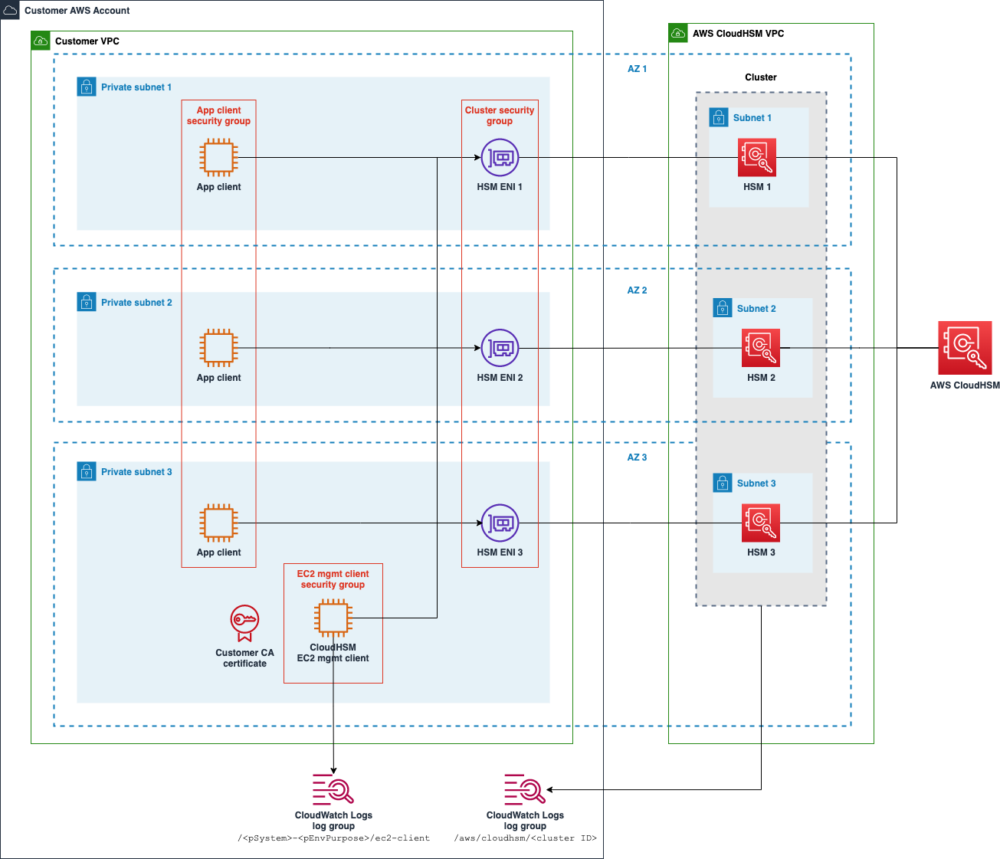
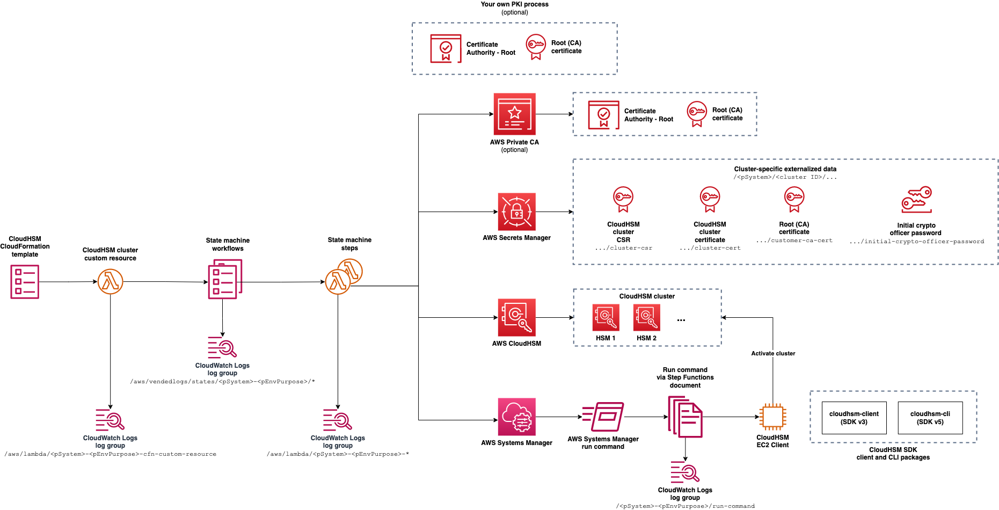

# Automated Provisioning of AWS CloudHSM Clusters Using AWS CloudFormation

The `cloudhsm.yml` AWS CloudFormation template automatically provisions an [AWS CloudHSM](https://docs.aws.amazon.com/cloudhsm/latest/userguide/introduction.html) cluster with HSMs and supporting AWS resources.

The `cloudhsm-key-store.yml` template creates a [CloudHSM key store for KMS](https://docs.aws.amazon.com/kms/latest/developerguide/custom-key-store-overview.html) and connects it to a CloudHSM cluster. Instructions for using the `cloudhsm-key-store.yml` template are addressed in [CLOUDHSM-KEY-STORE](./CLOUDHSM-KEY-STORE.md).

These templates are intended to be used for learning and experimentation purposes. If you would like to learn more about the supporting CloudFormation custom resources and how they use AWS Step Functions state machines and other AWS services, see [INTERNALS](./INTERNALS.md).

You can review an overview of significant changes in the [CHANGELOG](./CHANGELOG.md).

- [Overview](#overview)
- [Quick start](#quick-start)
- [Usage](#usage)
- [Managing security](#managing-security)
- [Using your own PKI process](#using-your-own-pki-process)
- [Reviewing template parameters](#reviewing-template-parameters)
- [Creating the stack](#creating-the-stack)
- [Troubleshooting stack creation](#troubleshooting-stack-creation)
- [Performing post stack creation steps](#performing-post-stack-creation-steps)
- [Updating the stack](#updating-the-stack)
- [Monitoring and managing the resources](#monitoring-and-managing-the-resources)
  - [Monitoring and managing the CloudHSM cluster](#monitoring-and-managing-the-cloudhsm-cluster)
  - [Managing the EC2 client instance](#managing-the-ec2-client-instance)
  - [Creating a CloudHSM cluster from a backup](#creating-a-cloudhsm-cluster-from-a-backup)
  - [Saving costs by deleting HSMs](#saving-costs-by-deleting-hsms)
- [Deleting the stack](#deleting-the-stack)
- [Creating and managing a CloudHSM key store with AWS KMS](#creating-and-managing-a-cloudhsm-key-store-with-aws-kms)
- [Notifying of potential security issues](#notifying-of-potential-security-issues)
- [Contributing](#contributing)
- [License](#license)

## Overview

The [`cloudhsm.yml`](cloudhsm.yml) CloudFormation template enables you to create, update, and delete a CloudHSM cluster.

The following diagram represents a typical cluster and supporting resources that can be created using this template. The application clients and customer VPC and subnets are outside the scope of this automation.



In addition to a CloudHSM cluster and HSM resources, the following resources are created in support of the cluster:

- A CloudFormation custom resource AWS Lambda function is used to create, update, and delete the CloudHSM cluster
- AWS Step Functions state machines are used to orchestrate creating, updating, and deleting the CloudHSM cluster
- Lambda functions are used to support the state machines
- An Amazon EC2 client instance is configured to activate the cluster and manage users in the HSMs
- An AWS Systems Manager document is used by steps in the state machines to execute scripts on the EC2 client in support of cluster create and update operations
- An optional AWS Certificate Manager Private CA private CA and CA certificate are created to optionally issue the cluster certificate
- AWS Secrets Manager entries are created to support the creation and management of the CloudHSM cluster:
  - An automatically generated initial crypto officer (CO) `admin` user password
  - The cluster's CSR
  - The customer CA cert under which the cluster cert is issued
  - The cluster cert in the case where an external PKI process is used to issue the cluster cert
- IAM service roles are used to support the resources referenced above

The following diagram shows the AWS services and resources that this templates uses to orchestrate creating, updating, and deleting a CloudHSM cluster:



## Quick start

- Ensure that the subnet in which the EC2 client will be created has connectivity to the internet in support of package downloads. For example, a private subnet for which routing to the internet via a NAT gateway has been established.
- Create a new stack and CloudHSM cluster:
  - Select a VPC
  - Select at least one of your private subnets for the CloudHSM cluster
  - Select one of your private subnets for the EC2 client that will be used to help manage your cluster
  - Leave all other defaults in place

## Usage

### Reviewing the opinionated approach

This CloudFormation template takes an opinionated approach to deploying and initializing a CloudHSM cluster. Since this approach might not be aligned with your organization's requirements, you should review the approach before using the template.

For example, this template results in an initial crypto officer (CO) password being automatically assigned. You're expected to change the crypto officer's password immediately after initialization of the cluster.

### Preparing to create a CloudHSM cluster

You should address the following considerations before using the CloudFormation template.

#### 1. Review AWS CloudHSM documentation

Ensure that you're familiar with the basic architecture and operation of [AWS CloudHSM Clusters](https://docs.aws.amazon.com/cloudhsm/latest/userguide/clusters.html)

#### 2. Determine qualifier for cloud resource names

Determine a value for the [`pEnvPurpose`](#reviewing-template-parameters) CloudFormation template parameter that will be used to help qualify the names of many of the cloud resources created by the CloudHSM stack. If you intend to deploy only one instance of the stack and CloudHSM cluster in the AWS account, then you can use the default value.

Many of the resources created by the CloudHSM template will be qualified by a combination of the `pSystem` and `pEnvPurpose` parameter values. Normally, you won't need to override the value of the `pSystem` parameter, but if you intend to manage multiple CloudHSM clusters in the same account, then you will need to use the `pEnvPurpose` parameter to help distinguish the resources used to support the respective clusters. For example, if you create multiple stacks in the same account and in the same Region for testing purposes, then specify values such as `test1` vs `test2` for the `pEnvPurpose` parameter.

Since the CloudHSM template automatically qualifies the names of global resources such as IAM roles with the AWS Region identifier, you do not need to include a Region identifier in the `pEnvPurpose` parameter.

If you intend to create multiple CloudHSM clusters in a single AWS account, then review [AWS CloudHSM Quotas](https://docs.aws.amazon.com/cloudhsm/latest/userguide/limits.html) so that you're aware of the default upper limit of the number of clusters and HSMs you can create in each account.

#### 3. Determine the VPC, subnets, and number of HSMs

Determine an existing VPC with which you want the HSMs associated. When you create a cluster, an elastic network interface (ENI) will be created in the subnets that you specify via the `pSubnets` parameter.

Use the `pHsmsPerSubnet` parameter to specify the number of HSMs to create per subnet.

Typically, you will want to specify at least two subnets and one HSM per subnet for each CloudHSM cluster. However, in support of some testing scenarios, you might want to reduce the time required to create the stack by specifying a single subnet and one HSM per subnet.

If you intend to connect a KMS CloudHSM key store to the cluster, you'll need to specify a configuration that results in at least two HSMs.

##### Determining regions and AZs in which CloudHSM is available

See [AWS CloudHSM service endpoints](https://docs.aws.amazon.com/general/latest/gr/cloudhsm.html) for the list of regions in which CloudHSM is supported.

AWS CloudHSM might not be available in all Availability Zones in a given Region.

One method of determining the AZs in which CloudHSM is available in a given region is to inspect the results from querying the AZs in which [CloudHSM VPC interface endpoints](https://docs.aws.amazon.com/cloudhsm/latest/userguide/cloudhsm-vpc-endpoint.html) are available. In the following example, the AZs through which CloudHSM interface endpoints are available in the region `us-east-1` are listed:

```
aws ec2 describe-vpc-endpoint-services --service-names com.amazonaws.us-east-1.cloudhsmv2 --region us-east-1 --query 'ServiceDetails[0].AvailabilityZones'
```

Resulting in:

```
[
    "us-east-1b",
    "us-east-1c",
    "us-east-1d",
    "us-east-1f"
]
```

Given the set of AZs in which CloudHSM is available, you can map the AZs to your own subnets. For example, in a particular VPC, the following command will list the subnets and AZ names:

```
aws ec2 describe-subnets --filter Name=vpc-id,Values=<vpc ID> | jq -r '.Subnets[]|.SubnetId+" "+.AvailabilityZone+" "+.AvailabilityZoneId+" "+ try(select(.Tags[].Key=="Name") | .Tags[].Value) catch "NO TAGS"'
```

Resulting in:

```
subnet-0f0...07b us-east-1c use1-az4 infra-dev-shared-private-3
subnet-075...6d7 us-east-1b use1-az2 infra-dev-shared-private-2
subnet-0f3...b2a us-east-1c use1-az4 infra-dev-shared-public-3
subnet-0e7...9ca us-east-1b use1-az2 infra-dev-shared-public-2
subnet-09...3e8 us-east-1a use1-az1 infra-dev-shared-private-1
subnet-0f...8c6 us-east-1a use1-az1 infra-dev-shared-public-1
```

When you create a CloudHSM cluster using this CloudFormation template, you should provide only the subnets associated with the AZs in which CloudHSM is available.

#### 4. Determine the subnet in which to deploy the EC2 client instance

You'll need to determine the VPC and subnet in which an EC2 client instance that interacts with the HSMs in the cluster. Typically, the subnet will be in the same VPC as the HSMs ENIs.

#### 5. Determine whether or not you want to use your own PKI process for issuing the cluster certificate

Before a CloudHSM cluster can be initialized, a certificate signing request (CSR) must be obtained from the cluster and used to issue a certificate for the cluster. The cluster certificate and a root CA certificate are used by CloudHSM during cluster initialization.

By default, the template creates a root CA and CA certificate using AWS Certificate Manager Private CA. The CA certificate is used to process the CSR and issue a cluster certificate. This built-in, fully automated process may be suitable for experimentation and development purposes.

If you'd like to use your own PKI process, you can use set the parameter `pUseExternalPkiProcess` to `true` to force the stack creation process to defer initialization of the cluster until you've issued a cluster certificate via your own PKI process. See [Using your own PKI process](#using-your-own-pki-process) and [Reviewing template parameters](#reviewing-template-parameters) for further details on the overall process.

## Managing security

A security review has been performed on the CloudFormation templates contained in this repository. This solution assumes that CloudHSM cluster will be deployed and managed in the following manner:

- You specify a private subnet that does not support publicly addressable IP addresses to be used for the EC2 client instance
- You stop (not terminate) the EC2 client instance once management has been completed so that it is normally in the `stopped` state
- You power on the EC2 client instance to the `running` state when you need to manage the CloudHSM cluster via the EC2 client instance
- You access the EC2 client instance only through AWS Systems Manager (SSM) Session Manager
- You take measures to either patch the EC2 client in place using AWS Systems Manager or similar or you periodically replace the EC2 client instance by updating the stack. See [Managing the EC2 client instance](#managing-the-ec2-client-instance) for details.
- You limit interactions with the CloudHSM cluster and its HSMs during normal operations to the use of the KMS service and use of the custom key store
- You take the following steps immediately after the CloudHSM cluster is created:
  1. The Crypto Officer/Primary Crypto Officer (CO/PCO) password is changed
  1. Once the password is changed, it should be stored in a secure password vault

See [Performing Post Stack Creation Steps](#performing-post-stack-creation-steps) for details on managing the Crypto Officer/Primary Crypto Officer (CO/PCO) password.

### Static analysis of the CloudFormation template

The CloudFormation template `cloudhsm.yml` has been scanned using the `cfn_nag` and `bandit` tools.

Stelligent's [cfn_nag](https://github.com/stelligent/cfn_nag) static analysis tool has been used to evaluate vulnerabilities within the template. All `failing` findings have been resolved. `warning` findings have been left intact to inform users of potential security findings that should be reviewed before using the templates. For a complete report of the warnings and notes on why they were not resolved, see the `security/` folder.

PyCQA's [bandit](https://github.com/PyCQA/bandit) static analysis tool has be used to evaluate inline Python code contained in the template. No issues were identified based on these tests. See the `security/` folder for `bandit` results. If you'd like to run `bandit` on your own against the inline Python code, see the example script under `./test/scripts/bandit-inline-python.sh`.

## Using your own PKI process

If you intend to use your own PKI process to issue a cluster certificate, you will first create the stack and then carry out your own PKI process to issue the cluster certificate. After you've issued the cluster certificate, you copy the cluster and CA certificates to already created secrets in AWS Secrets Manager and perform a stack update to complete initialization and activation of the cluster.

1. Create a new stack while selecting `true` for the parameter `pUseExternalPkiProcess`. Doing so will cause the stack creation process to perform only the initial cluster creation steps. Steps that depend on the cluster certificate being available are deferred until you follow the remaining steps.
2. Obtain the cluster CSR by accessing Secrets Manager.
3. Using your own PKI process, issue a cluster certificate. See [Options for testing use of your own PKI process](#options-for-testing-use-of-your-own-pki-process) for examples.
4. Make your root CA certificate and the newly issued cluster certificate available via Secrets Manager.
5. Perform an update to your stack. When performing the stack update, set the parameter `pExternallyProvidedCertsReady` to `true` to indicate that the cluster and CA certificates are ready for the stack update process to consume.

The stack update process will obtain the cluster certificate and CA certificate from Secrets Manager, initialize and activate the cluster, and add HSMs as necessary.

The following secrets are created automatically as part of stack creation. When you use your own PKI process, you'll need to update two of the secrets prior to updating the stack.

| Secrets Manager Secret                    | Description                                                                                                                                                                                                                                     |
| ----------------------------------------- | ----------------------------------------------------------------------------------------------------------------------------------------------------------------------------------------------------------------------------------------------- |
| `<pSystem>-<cluster ID>-cluster-csr`      | When you create a stack, this secret is populated with a CSR for the cluster certificate. If you opted to use your own PKI process, you will use this CSR to issue a cluster certificate.                                                       |
| `<pSystem>-<cluster ID>-cluster-cert`     | If you opted to use your own PKI process, you will need to update this secret to represent the plaintext form of the cluster certificate before you perform a stack update. Ensure that you add the certificate as a string rather than binary. |
| `<pSystem>-<cluster ID>-customer-ca-cert` | If you opted to use your own PKI process, you will need to update this secret to represent the plaintext form of the root CA certificate before you perform a stack update. Ensure that you add the certificate as a string rather than binary. |

### Options for testing use of your own PKI process

You can consult the [AWS CloudHSM documentation](https://docs.aws.amazon.com/cloudhsm/latest/userguide/initialize-cluster.html) for an example of using the `openssl` CLI to help support the process of issuing a cluster certificate.

You can also use AWS Certificate Manager Private CA (PCA) to issue a cluster certificate. This template uses AWS PCA to do this automatically when you use `false` for `pUseExternalPkiProcess`. Once you have a root CA set up with PCA, you can use the following commands to issue the cluster certificate and obtain copies of the cluster and CA certificates.

#### Obtain the cluster CSR from Secrets Manager

```
aws secretsmanager get-secret-value --secret-id /cloudhsm/<cluster ID>/cluster-csr --query SecretString --output text > csr.pem
```

#### Issue the cluster certificate

```
aws acm-pca issue-certificate --certificate-authority-arn <CA ARN> --csr fileb://csr.pem --signing-algorithm "SHA256WITHRSA" --validity Value=365,Type="DAYS"
```

#### Obtain a copy of the cluster certificate

```
aws acm-pca get-certificate --certificate-authority-arn <CA arn> --certificate-arn <cluster cert ARN> --query Certificate --output text
```

#### Obtain a copy of the CA cert

```
aws acm-pca get-certificate --certificate-authority-arn <CA arn> --certificate-arn <cluster cert ARN> --query CertificateChain --output text
```

## Reviewing template parameters

| Parameter                       | Required | Description                                                                                                                                                                                                                                                                                                                                                                                                                                                                                                                                                                                                                                                                                                                                  | Default                                                         | Supported in Stack Updates?                                      |
| ------------------------------- | -------- | -------------------------------------------------------------------------------------------------------------------------------------------------------------------------------------------------------------------------------------------------------------------------------------------------------------------------------------------------------------------------------------------------------------------------------------------------------------------------------------------------------------------------------------------------------------------------------------------------------------------------------------------------------------------------------------------------------------------------------------------- | --------------------------------------------------------------- | ---------------------------------------------------------------- |
| `pSystem`                       | Optional | Used as a prefix in the names of many of the newly created cloud resources. You normally do not need to override the default value.                                                                                                                                                                                                                                                                                                                                                                                                                                                                                                                                                                                                          | `cloudhsm`                                                      | No                                                               |
| `pEnvPurpose`                   | Optional | Identifies the purpose for this particular instance of the stack. Used as part of the prefix in the names of many of the newly created resources. Enables you to create and more easily distinguish resources of multiple stacks in the same AWS account. For example, `1`, `2`, `test1`, `test2`, etc.                                                                                                                                                                                                                                                                                                                                                                                                                                      | `1`                                                             | No                                                               |
| `pSubnets`                      | Required | List of subnets to associate with the CloudHSM cluster. Subnets must exists within the same VPC. Only one subnet per availability zone (AZ) may be specified.<br><br>If you're using an AWS region that provides access to more than 3 AZs, ensure that you supply subnet IDs associated with AZs in which CloudHSM is available. See [Determining regions and AZs in which CloudHSM is available](#determining-regions-and-azs-in-which-cloudhsm-is-available) for details.<br><br>Since CloudHSM does not support making changes to the to the list of subnets after a cluster is created, this template does not support making changes to the list of subnets during stack updates.                                                      | None                                                            | No                                                               |
| `pHsmsPerSubnet`                | Optional | Number of HSMs to create per subnet.<br><br>If you intend to connect a KMS custom key store to the cluster, a minimum of 2 HSMs is required. In the simplest case, to support a KMS custom key store, you could specify one subnet in `pSubnets` and `2` for `pHsmsPerSubnet`.<br><br>See the [AWS CloudHSM Quotas](https://docs.aws.amazon.com/cloudhsm/latest/userguide/limits.html) for the maximum total HSMs you can create per cluster.<br><br>You can modify this parameter during a stack update to either grow or shrink the number of HSMs.<br><br>During a stack update, you can specify `0` to delete all HSMs in the cluster without deleting the cluster. See [Saving costs by deleting HSMs](#saving-costs-by-deleting-hsms). | `1`                                                             | Yes                                                              |
| `pHsmType`                      | Optional | The type of HSM to use in the cluster. Currently the only supported value is `hsm1.medium`                                                                                                                                                                                                                                                                                                                                                                                                                                                                                                                                                                                                                                                   | `hsm1.medium`                                                   | No                                                               |
| `pUseExternalPkiProcess`        | Optional | Select `true` if you want to use your own PKI process to issue a cluster certificate based on the CSR obtained from the cluster creation process. By default, the stack uses AWS Private CA to create a root CA and issue the cluster certificate. See [Determine whether or not you want to use your own PKI process for issuing the cluster certificate](#5-determine-whether-or-not-you-want-to-use-your-own-pki-process-for-issuing-the-cluster-certificate) to help you understand if this option applies to you.                                                                                                                                                                                                                       | `false`                                                         | Yes                                                              |
| `pExternallyProvidedCertsReady` | Optional | Select `true` only if you selected `true` for `pUseExternalPkiProcess` and you've made the necessary certificates available per the process outlined in [Using your own PKI process](#using-your-own-pki-process). This parameter is only processed during stack update operations.<br><br>After you've successfully completed an update based on using your own PKI process, you may leave this parameter set to `true` for subsequent stack updates. The cluster and CA certificates will be processed only once.                                                                                                                                                                                                                          | `false`                                                         | Yes                                                              |
| `pBackupRetentionDays`          | Optional | Number of days to retain CloudHSM cluster backups. You may specify from `7` to `379` days.                                                                                                                                                                                                                                                                                                                                                                                                                                                                                                                                                                                                                                                   | `90`                                                            | No                                                               |
| `pBackupId`                     | Optional | ID of CloudHSM backup if you want create the cluster from a backup. See [Creating a CloudHSM cluster from a backup](#creating-a-cloudhsm-cluster-from-a-backup).                                                                                                                                                                                                                                                                                                                                                                                                                                                                                                                                                                             | None                                                            | No                                                               |
| `pClientPkg`                    | Optional | Specify either the CloudHSM client package `cloudhsm-client` or CloudHSM CLI package `cloudhsm-cli` to be installed and configured.<br><br>The CloudHSM client package from the CloudHSM SDK v3 includes the cluster and key management utilities CMU and KMU.<br><br>The CloudHSM CLI package from the CloudHSM SDK v5 does not include the CMU and KMU utilities.                                                                                                                                                                                                                                                                                                                                                                          | `cloudhsm-client`                                               | Yes<br><br>You can change this option as part of a stack update. |
| `pClientVpcId`                  | Required | The VPC in which the EC2 client will be created.                                                                                                                                                                                                                                                                                                                                                                                                                                                                                                                                                                                                                                                                                             | None                                                            | No                                                               |
| `pClientSubnet`                 | Required | The subnet within the VPC specified by `pClientVpcId` in which the EC2 client will be created.                                                                                                                                                                                                                                                                                                                                                                                                                                                                                                                                                                                                                                               | None                                                            | Yes<br><br>Causes replacement of the EC2 instance.               |
| `pClientType`                   | Optional | Instance type to use for the EC2 client                                                                                                                                                                                                                                                                                                                                                                                                                                                                                                                                                                                                                                                                                                      | `t3a.small`                                                     | Yes<br><br>Does not cause replacement of the EC2 instance.       |
| `pClientAmiSsmParameter`        | Optional | SSM parameter name for EC2 AMI to use for the EC2 client.                                                                                                                                                                                                                                                                                                                                                                                                                                                                                                                                                                                                                                                                                    | `/aws/service/ami-amazon-linux-latest/amzn2-ami-hvm-x86_64-ebs` | No                                                               |
| `pClientAmiId`                  | Optional | ID of EC2 AMI to use for the EC2 client.<br><br>Overrides `pClientAmiSsmParameter` when present.<br><br>If you desire to have direct control over the AMI in use, specify this parameter.                                                                                                                                                                                                                                                                                                                                                                                                                                                                                                                                                    | None                                                            | Yes<br><br>Causes replacement of the EC2 instance.               |

## Creating the stack

Once you've addressed the preparation steps, you're ready to create the stack.

### 1. Create the stack

Use the [`cloudhsm.yml`](cloudhsm.yml) template to create a new stack.

### 2. Monitor progress of stack creation

Typically, creation of the stack will take ~10 to ~20 minutes depending on the number of HSMs to be created

The general order in which cloud resources are created is as follows:

- IAM service role and EC2 instance profile for the EC2 client instance
- EC2 client instance
- An EC2 UserData script is used in conjunction with [`AWS::CloudFormation::Init`](https://docs.aws.amazon.com/AWSCloudFormation/latest/UserGuide/aws-resource-init.html) to bootstrap the CloudHSM client instance
  - CloudWatch agent is configured
  - Package dependencies are installed
  - Several scripts are generated for subsequent execution from the state machines
- IAM service roles for AWS StepFunctions and Lambda functions
- Lambda functions to support StepFunction state machines
- StepFunction state machines
- CloudFormation Custom resource Lambda function
- CloudHSM cluster and the first HSMs

### 3. Inspect the created resources

Once the stack has been created, you can tour the environment to review the cloud resources. For example:

#### Inspect CloudHSM cluster

Access the CloudHSM console to view the CloudHSM cluster and HSMs.

- The state of the cluster and the associated HSM(s) should be `Active`
- Note the ENI IP address(es), AZs, and subnets in use
- Selecting `Backups` will show several backups already created due to the fact that changes were made to the cluster during initial provisioning

#### Inspect contents of Secrets Manager

Access the Secrets Manager console to view the generated secrets associated with the cluster.

- Initial crypto officer password
- Customer CA certificate used to connect the EC2 client instance to the cluster

#### Inspect Elastic Network Interfaces (ENIs)

Access the EC2 console and select Network Interfaces to inspect the ENIs that were created. Review the Description field. A CloudHSM managed ENI should be present for each HSM.

#### Inspect CloudHSM via the CloudHSM client or CLI

**CloudHSM client: Using the CloudHSM Management Utility (CMU)**

By default the CloudHSM client package from the CloudHSM SDK v3 is installed. The EC2 client instance has been configured with the [CloudHSM Management Utility (CMU)](https://docs.aws.amazon.com/cloudhsm/latest/userguide/cloudhsm_mgmt_util.html) to support ongoing inspection and configuration of your cluster. You can use the `cloudhsm_mgmt_util` CLI to execute the CMU.

Use AWS Systems Manager Session Manager to access a terminal session to the EC2 client instance. See [Monitoring EC2 client instance configuration](#monitoring-ec2-client-instance-configuration) for details.

Once you're in the terminal session, execute:

```
/opt/cloudhsm/bin/cloudhsm_mgmt_util /opt/cloudhsm/etc/cloudhsm_mgmt_util.cfg
```

For each HSM, you should see a connection being established.

A subset of the [CMU commands](https://docs.aws.amazon.com/cloudhsm/latest/userguide/cloudhsm_mgmt_util-reference.html) can be executed before logging in. For example:

- `getHSMInfo` - Lists details of each HSM
- `listUsers` - Lists users defined on each HSM. The set of users should be identical across HSMs.
- `info server 0` - List details of each HSM. Replace `0` with the index of the HSM of interest.

**CloudHSM CLI: Using CloudHSM CLI**

If you opted to install the CloudHSM CLI from the CloudHSM SDK v5, the EC2 client instance has been configured with the [CloudHSM Client CLI](https://docs.aws.amazon.com/cloudhsm/latest/userguide/cloudhsm_cli.html).

Use AWS Systems Manager Session Manager to access a terminal session to the EC2 client instance. See [Monitoring EC2 client instance configuration](#monitoring-ec2-client-instance-configuration) for details.

Once you're in the terminal session, execute:

```
/opt/cloudhsm/bin/cloudhsm-cli interactive
```

A subset of the [commands](https://docs.aws.amazon.com/cloudhsm/latest/userguide/cloudhsm_cli-reference.html) can be executed before logging in. For example:

```
aws-cloudhsm > user list
```

## Troubleshooting stack creation

By default, when issues occur during stack creation, CloudFormation will attempt to rollback the changes by deleting the resources created up to the point of the failure. You can preserve the state of a failed stack creation attempt by creating the stack with the option to disable rollback on stack creation failure. If the resources have been rolled back and deleted, you won't have the opportunity to inspect the resources for the cause of the failure.

In this situation, you should delete the stack and attempt to create a new stack with an option to preserve successfully provisioned resources. When creating a stack again, in the CloudFormation console, in "Stack failure options", select "Preserve successfully provisioned resources".

### `rClientInstance` creation failure

If you notice that stack creation fails on creation of the `rClientInstance` EC2 client instance resource, you should verify that the subnet in which the EC2 instance has been created has connectivity to the internet. Since the EC2 client needs to download several packages and access AWS service APIs during first boot, internet connectivity is required.

If you've verified that the EC2 client has connectivity to the internet, you should inspect the content of the `/var/log/cfn-init.log` log file produced by the EC2 client instance.

Use AWS Systems Manager Session Manager to access a terminal session to the EC2 client instance. In the EC2 console, you'll see an instance named based on the the `pSystem` and `pEnvPurpose` parameters. You can select that instance, select `Connect`, select `Session Manager`, and select `Connect` in an attempt to access a terminal session of the instance.

If the EC2 client's first boot progressed to a sufficient point, you should also be able to review the content of the `/var/log/cfn-init.log` via the CloudWatch console.

### `rCloudHsmCluster` creation failure

Since most of the operations supporting stack creation occur via the create cluster state machine in Step Functions, you should familiarize yourself with monitoring the execution of state machines. You can access the Step Functions console and select the `...-create` state machine to isolate the step at which the failure occurred.

In the CloudWatch Logs console, you can review the output of the `...-create-cluster` Lambda function and other functions that support the state machine.

## Performing post stack creation steps

### Changing the crypto officer password

As a security best practice, you should change the Crypto Officer (CO) password immediately after the stack is created.

**CloudHSM client: Using the CloudHSM Management Utility (CMU)**

By default the CloudHSM client package from the CloudHSM SDK v3 is installed. The EC2 client instance has been configured with CloudHSM SDK v3 that includes the [CloudHSM Management Utility (CMU)](https://docs.aws.amazon.com/cloudhsm/latest/userguide/cloudhsm_mgmt_util.html) to support ongoing inspection and configuration of your cluster. You can use the `cloudhsm_mgmt_util` CLI to execute the CMU.

Use AWS Systems Manager Session Manager to access a terminal session to the EC2 client instance. See [Monitoring EC2 client instance configuration](#monitoring-ec2-client-instance-configuration) for details.

Once you're in the terminal session:

1. Obtain the initial crypto officer (CO) password from Secrets Manager
2. Execute:

```
/opt/cloudhsm/bin/cloudhsm_mgmt_util /opt/cloudhsm/etc/cloudhsm_mgmt_util.cfg
```

For each HSM, you should see a connection being established.

3. At the `aws-cloudhsm>` prompt, log in via the CO `admin` user:

```
aws-cloudhsm>loginHSM CO admin -hpswd
```

4. Enter the initial password for the CO user that you obtained from Secrets Manager
5. You should see a successful login for each HSM.
6. Change the password:

```
aws-cloudhsm>changePswd CO admin -hpswd
```

7. Specify the password
8. Enter `quit` to exit the CMU

You should store the new password in your standard enterprise password vault.

At this stage, you can optionally delete the secret from Secrets Manager given that the initial password is no longer needed for operation of the cluster.

If you requested creation of a KMS custom key store, KMS has already changed the initial password for the `kmsuser` across the HSMs.

**CloudHSM CLI: Using CloudHSM CLI**

If you opted to install the CloudHSM CLI from the CloudHSM SDK v5, the EC2 client instance has been configured with the [CloudHSM Client CLI](https://docs.aws.amazon.com/cloudhsm/latest/userguide/cloudhsm_cli.html).

Use AWS Systems Manager Session Manager to access a terminal session to the EC2 client instance. See [Monitoring EC2 client instance configuration](#monitoring-ec2-client-instance-configuration) for details.

Once you're in the terminal session:

1. Obtain the initial crypto officer (CO) password from Secrets Manager
2. Execute:

```
/opt/cloudhsm/bin/cloudhsm-cli interactive
```

3. Log in via the CO/admin user:

```
aws-cloudhsm > login --username admin --role admin
```

4. Enter the initial password for the CO user that you obtained from Secrets Manager
5. You should see a successful login
6. Change the password:

```
aws-cloudhsm > user change-password --username admin --role admin
```

7. Specify the password
8. Enter `quit` to exit the CLI

You should store the new password in your standard enterprise password vault.

At this stage, you can optionally delete the secret from Secrets Manager given that the initial password is no longer needed for operation of the cluster.

If you requested creation of a KMS custom key store, KMS has already changed the initial password for the `kmsuser` across the HSMs.

## Updating the stack

The CloudFormation template currently supports a limited number of template parameters that can be applied via CloudFormation stack updates. See [CloudFormation Template Parameters](#reviewing-template-parameters) for the stack parameters that can be updated.

## Monitoring and managing the resources

### Monitoring and managing the CloudHSM cluster

See the following resources for information on monitoring and managing your CloudHSM cluster:

- [Monitoring AWS CloudHSM](https://docs.aws.amazon.com/cloudhsm/latest/userguide/get-logs.html)
- [Managing Backups](https://docs.aws.amazon.com/cloudhsm/latest/userguide/manage-backups.html)

### Managing the EC2 client instance

#### Stopping the EC2 client when not in use

After a cluster has been activated, the EC2 client is not required for application including the optional KMS custom key store to use the cluster. Consequently, you have the option to stop (not terminate) the EC2 client instance and restart it only when you either need to update it or use the CloudHSM management utility to inspect the configuration of the cluster.

#### Keeping the EC2 client up-to-date

Although the EC2 client does not need to be running in order for applications and a KMS custom key store to operate against your CloudHSM cluster, you will want to ensure that your EC2 client instance is kept up-to-date with necessary operating system patches.

You should also monitor the availability of new releases of the CloudHSM Management Utility (CMU) and consider updating it over time. See [Install and Configure the AWS CloudHSM Client (Linux)](https://docs.aws.amazon.com/cloudhsm/latest/userguide/install-and-configure-client-linux.html).

#### Replacing the EC2 client instance

If you specified an AMI ID during stack creation, you can perform a stack update using a different AMI ID to force replacement of the EC2 client instance. During the replacement process, the new EC2 client instance will be configured with the latest available software packages.

During the stack update process, CloudFormation will create a new EC2 client instance. The first boot automation process in the new EC2 client instance will recognize the presence of the previously generated customer CA certificate in Secrets Manager and use the certificate to help configure the client instance. Once the new EC2 client instance has been created, CloudFormation will terminate the old EC2 client instance.

You can also force replacement of the EC2 client instance by specifying a different subnet during a stack update.

#### Addressing a terminated EC2 client instance

If the EC2 client was terminated outside of a stack delete operation, you can use the CloudFormation template to create a new CloudHSM cluster from a backup. This process will create and configure a new EC2 client instance.

### Creating a CloudHSM cluster from a backup

The CloudFormation template supports the ability to create a new CloudHSM cluster from a backup. As long as at least one backup from a cluster exists, you can create a new stack while specifying the ID of the backup of interest. If you specify a valid backup ID via the parameter `pBackupId` during stack creation, the stack creation process will use the specified backup to create a new cluster.

If you're creating a new cluster from a backup with which a KMS custom key store was previously connected, ensure that the backup you select contains the KMS key data that you require to be present in your newly created cluster.

Since a CloudHSM backup retains the state of a cluster, creating a new cluster using a backup does not require initialization and activation of the newly created cluster. As part of the stack creation process and after the cluster is restored from the specified backup, the number of HSMs per subnet that you specified when creating the new stack will be created.

### Saving costs by deleting HSMs

If you have a non-production cluster that doesn't need to be used at all times, you can perform a stack update to delete all of the HSMs without deleting the cluster. Later, when you need to use the cluster, you can perform a stack update to recreate the number of HSMs of interest. By retaining the original cluster, you can avoid the process of creating a new cluster including issuing a cluster certificate.

#### Delete all HSMs without deleting a cluster

To delete all HSMs without deleting a cluster, set the `pHsmsPerSubnet` parameter to `0` during a stack update.

Since CloudHSM makes a backup of the cluster when an HSM is removed, you'll have an up-to-date cluster backup that will be used when you create new HSMs. See [Managing AWS CloudHSM backups](https://docs.aws.amazon.com/cloudhsm/latest/userguide/manage-backups.html.)

#### Create HSMs in an empty cluster

When you need to use the cluster again, during a stack update, you can set the `pHsmsPerSubnet` parameter to the desired number of HSMs.

When the new HSMs are added to an CloudHSM cluster that doesn't have any HSMs, CloudHSM will use the most recent cluster backup as the basis for the newly created HSMs.

#### Ensure application client configurations are updated

Note that when you create HSMs, the IP addresses of the HSMs may be different from the original set of HSMs. Consequently, you'll need to ensure that application client configurations are updated to reference at least one of the newly created HSMs. See [Connect the client SDK to the AWS CloudHSM cluster](https://docs.aws.amazon.com/cloudhsm/latest/userguide/cluster-connect.html#connect-how-to) for information on configuring application clients to work with your cluster.

The CloudFormation template automatically updates the EC2 client's configuration when HSMs are created and deleted.

## Deleting the stack

Deletion of the stack generally reverses the process described earlier. When the CloudFormation custom resource is called with the `delete` action, a CloudHSM cluster delete state machine is executed to delete the HSMs and the cluster.

An entry in Secrets Manager containing the customer CA certificate associated with the creation of the cluster will be preserved so that the certificate can be reused in the event that you create a new cluster from a backup.

## Creating and managing a CloudHSM key store with AWS KMS

See [CLOUDHSM-KEY-STORE](./CLOUDHSM-KEY-STORE.md) for details on using the `cloudhsm-key-store.yml` CloudFormation template.

## Notifying of potential security issues

See [CONTRIBUTING](CONTRIBUTING.md#security-issue-notifications) for more information on notifying AWS/Amazon Security about potential security issues.

## Contributing

See [CONTRIBUTING](CONTRIBUTING.md) for more information.

## License

This library is licensed under the MIT-0 License. See the LICENSE file.
