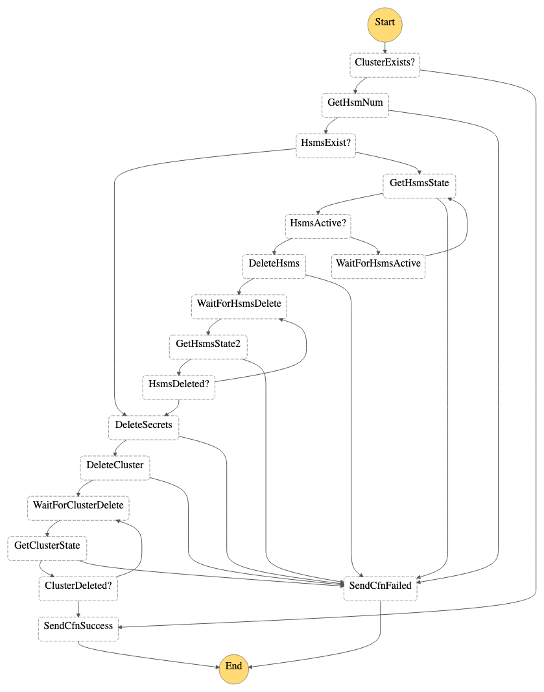

# Automated Deployment of AWS CloudHSM Resources

This AWS CloudFormation template automatically deploys a set of [AWS CloudHSM](https://docs.aws.amazon.com/cloudhsm/latest/userguide/introduction.html) resources and supporting AWS resources to be able to use AWS CloudHSM in support of [AWS KMS custom key stores](https://docs.aws.amazon.com/kms/latest/developerguide/custom-key-store-overview.html).

## Overview

Creation of a CloudFormation stack using this template automatically creates:
* AWS Lambda Functions and AWS Step Functions state machines to orchestrate creation and deletion of the CloudHSM cluster and HSM resources
* A CloudHSM cluster
* CloudHSM HSMs in the cluster
* An EC2 client configured to manage the cluster and HSMs
* An initial crypto officer password and stores it in AWS Secrets Manager
* A CloudHSM trust anchor certificate

In addition to the creation and initialization of a CloudHSM cluster and HSMs, the stack creates:
* A KMS custom key store backed by the cluster
* An initial `kmsuser` crypto user password

Deletion of the the CloudFormation stack results in the removal of these resources.

### AWS Lambda functions and AWS Step Functions state machines

Since management of CloudHSM resources is not yet available through resources built into CloudFormation, a series of AWS Lambda functions are deployed as part of the CloudFormation template to carry out the work of managing CloudHSM resources.

Since the processes required to create and delete clusters and HSMs may take longer than the maximum Lambda function execution time of 15 minutes, a set of AWS Step Functions state machines are created by the CloudFormation template to orchestrate management of CloudHSM resources. 

#### CloudHSM cluster create state machine

#### CloudHSM cluster delete state machine

## Assumptions

...

## Usage

## CloudFormation Template Parameters

|Parameter|Required|Description|Default|
|---------|--------|-----------|-------|
|`VPCInput`|Optional|The VPC in which the HSM ENIs will be provisioned and in which the EC2 client will be deployed.|None|
|`ClientInstanceSubnet`|Optional|The subnet in which the EC2 client will be deployed.|None|
|`ImageId`|Optional|EC2 image ID to use for the EC2 client.|`/aws/service/ami-amazon-linux-latest/amzn2-ami-hvm-x86_64-ebs`|
|`InstanceType`|Optional|Instance type to use for the EC2 client|`t2.medium`|

## Troubleshooting deployment

...

## Changing the crypto officer password

...

## Managing the EC2 client

...

## Deploying the EC2 Client Later On

We should document the process to replace the EC2 client
  * Use cases
    * Inadvertent deletion
    * Keep it up-to-date in terms of libraries, ...

## Back up and restore

...is there anything with the automation to enable backup/restore...

...pointer to existing documentation...

* backup automatically every 24 hours
* mutate ops trigger backup
* create second HSM, backup of the cluster with one hsm, then restore happens to create second hsm (behind the scene)

## Operations

* Is the automation making both HSMs active? 
  * Yes, both HSMs are active
  * Reason why: custom key store pre-requisites

## Enhancements to do for NuData

* Store the trust anchor certificate securely outside the client instance. Durable and available. (e.g. Secrets Manager)

### Potential future enhancements

* Support changing the number of HSMs after the initial deployment by updating a parameter for the number of HSMs and updating the stack.
* Parameterize the subnets/AZs in which to deploy the HSMs
* Make the number of HSMs to deploy a parameter. Useful development and testing use cases.
* Parameterize the HSM instance type
* Make the creation of KMS custom key store an option so that the template supports uses cases in which KMS is not required.

## To Do

* Ensure command failure causes cfn-init to fail
  * https://github.com/widdix/aws-cf-templates/blob/master/ec2/al2-mutable-public.yaml#L1007
* Move temp files to /tmp/ rather than /
* move from hsm_ip.txt to using environment variable
* does security group need to be done in the userdata? It doesn't get deleted
* resource naming?